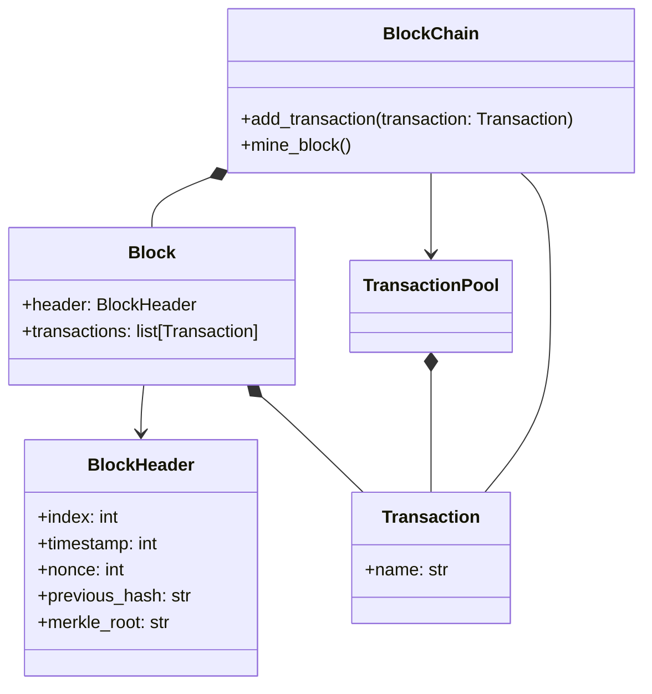

# Simple BlockChain implementation with Python
This is a sample implementation about BlockChain with Python for study.

## Usage
The following code snippet is the same as [main.py].
```python
from blockchain import BlockChain
from blockchain.Transaction import Transaction

if __name__ == '__main__':
    blockchain = BlockChain(difficulty=4)

    blockchain.add_transaction(Transaction(name="Alice"))
    blockchain.print_chain()

    blockchain.mine_block()
    blockchain.print_chain()

    blockchain.add_transaction(Transaction(name="Bob"))
    blockchain.add_transaction(Transaction(name="John"))
    blockchain.mine_block()
    blockchain.print_chain()
```
Output example:
```text
armProjects/BlockChainSample/.venv/bin/python /Users/araki/PycharmProjects/BlockChainSample/main.py 
BlockChain is created (difficulty=4).
Add transaction (Transaction(name='Alice'))
Current BlockChain:
- chain=[Block(header=BlockHeader(index=0, timestamp=1756531359829634000, nonce=0, hash=0ec76fd0a1357d3acaf2e79f5a0cd73c9e3890b1f470ec0174002989ae3bce1c, previous_hash=, merkle_root=), transactions=[])] 
- transaction_pool=TransactionPool([Transaction(name='Alice')])
Start mining block.
- Current transaction pool: TransactionPool([Transaction(name='Alice')])
- Current chain: [Block(header=BlockHeader(index=0, timestamp=1756531359829634000, nonce=0, hash=0ec76fd0a1357d3acaf2e79f5a0cd73c9e3890b1f470ec0174002989ae3bce1c, previous_hash=, merkle_root=), transactions=[])]
-- Successfully mined new block with nonce=19406 (elapsed time=75.45ms).
Current BlockChain:
- chain=[Block(header=BlockHeader(index=0, timestamp=1756531359829634000, nonce=0, hash=0ec76fd0a1357d3acaf2e79f5a0cd73c9e3890b1f470ec0174002989ae3bce1c, previous_hash=, merkle_root=), transactions=[]), Block(header=BlockHeader(index=1, timestamp=1756531359829707000, nonce=19406, hash=000093a47479160c3d6f1c7c46411a607252e77f74af8b5fff3714b4fd92a374, previous_hash=0ec76fd0a1357d3acaf2e79f5a0cd73c9e3890b1f470ec0174002989ae3bce1c, merkle_root=3bc51062973c458d5a6f2d8d64a023246354ad7e064b1e4e009ec8a0699a3043), transactions=[Transaction(name='Alice')])] 
- transaction_pool=TransactionPool([])
Add transaction (Transaction(name='Bob'))
Add transaction (Transaction(name='John'))
Start mining block.
- Current transaction pool: TransactionPool([Transaction(name='Bob'), Transaction(name='John')])
- Current chain: [Block(header=BlockHeader(index=0, timestamp=1756531359829634000, nonce=0, hash=0ec76fd0a1357d3acaf2e79f5a0cd73c9e3890b1f470ec0174002989ae3bce1c, previous_hash=, merkle_root=), transactions=[]), Block(header=BlockHeader(index=1, timestamp=1756531359829707000, nonce=19406, hash=000093a47479160c3d6f1c7c46411a607252e77f74af8b5fff3714b4fd92a374, previous_hash=0ec76fd0a1357d3acaf2e79f5a0cd73c9e3890b1f470ec0174002989ae3bce1c, merkle_root=3bc51062973c458d5a6f2d8d64a023246354ad7e064b1e4e009ec8a0699a3043), transactions=[Transaction(name='Alice')])]
-- Successfully mined new block with nonce=102154 (elapsed time=444.15ms).
Current BlockChain:
- chain=[Block(header=BlockHeader(index=0, timestamp=1756531359829634000, nonce=0, hash=0ec76fd0a1357d3acaf2e79f5a0cd73c9e3890b1f470ec0174002989ae3bce1c, previous_hash=, merkle_root=), transactions=[]), Block(header=BlockHeader(index=1, timestamp=1756531359829707000, nonce=19406, hash=000093a47479160c3d6f1c7c46411a607252e77f74af8b5fff3714b4fd92a374, previous_hash=0ec76fd0a1357d3acaf2e79f5a0cd73c9e3890b1f470ec0174002989ae3bce1c, merkle_root=3bc51062973c458d5a6f2d8d64a023246354ad7e064b1e4e009ec8a0699a3043), transactions=[Transaction(name='Alice')]), Block(header=BlockHeader(index=2, timestamp=1756531359905862000, nonce=102154, hash=0000d2062c4c49e4cac1ed8025be43b271d9997cf2b7678bc3c337674317601f, previous_hash=000093a47479160c3d6f1c7c46411a607252e77f74af8b5fff3714b4fd92a374, merkle_root=0f6ab9c21e2cd25907085985ee5b2b21bb8d4d7f4e8014601f4b69c0a1dd8e52), transactions=[Transaction(name='Bob'), Transaction(name='John')])] 
- transaction_pool=TransactionPool([])
```

## NOTE
### About Transaction used in this project
To make implementation simple, the simple string transaction name is used as a source for hash calculation for the transaction.

### Design
