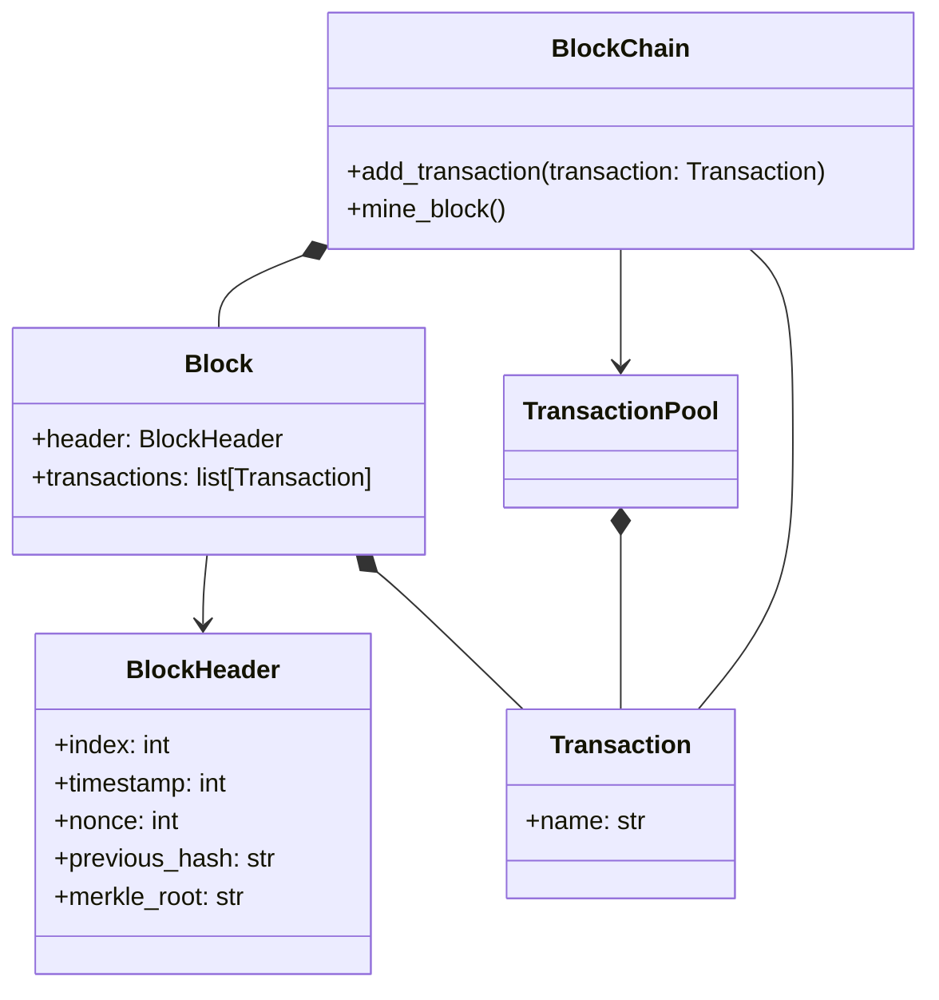

# Simple BlockChain implementation with Python
This is a sample implementation about BlockChain with Python for study.

## Usage
The following code snippet is the same as [main.py].
```python
from blockchain import BlockChain
from blockchain.Transaction import Transaction

if __name__ == '__main__':
    blockchain = BlockChain(difficulty=2)

    blockchain.add_transaction(Transaction(name="Alice"))
    blockchain.print_chain()

    blockchain.mine_block()
    blockchain.print_chain()

    blockchain.add_transaction(Transaction(name="Bob"))
    blockchain.add_transaction(Transaction(name="John"))
    blockchain.mine_block()
    blockchain.print_chain()
```
Output example:
```text
BlockChain is created (difficulty=2).
Add transaction (Transaction(name='Alice'))
Current BlockChain:
- chain=[Block(header=BlockHeader(index=0, timestamp=1756529295506663000, nonce=0, hash=9ff7d3d3c494ffc31ffdcb9382b26b483dd82d25ac84a040ae1e8bfdb307fd75, previous_hash=, merkle_root=), transactions=[])] 
- transaction_pool=TransactionPool([Transaction(name='Alice')])
Start mining block.
- Current transaction pool: TransactionPool([Transaction(name='Alice')])
- Current chain: [Block(header=BlockHeader(index=0, timestamp=1756529295506663000, nonce=0, hash=9ff7d3d3c494ffc31ffdcb9382b26b483dd82d25ac84a040ae1e8bfdb307fd75, previous_hash=, merkle_root=), transactions=[])]
-- Successfully mined new block with nonce=30.
Current BlockChain:
- chain=[Block(header=BlockHeader(index=0, timestamp=1756529295506663000, nonce=0, hash=9ff7d3d3c494ffc31ffdcb9382b26b483dd82d25ac84a040ae1e8bfdb307fd75, previous_hash=, merkle_root=), transactions=[]), Block(header=BlockHeader(index=1, timestamp=1756529295506733000, nonce=30, hash=003665d91c2ed70298c92072bf67b4de81fd9383ca8e134f064a0bef7a77c449, previous_hash=9ff7d3d3c494ffc31ffdcb9382b26b483dd82d25ac84a040ae1e8bfdb307fd75, merkle_root=3bc51062973c458d5a6f2d8d64a023246354ad7e064b1e4e009ec8a0699a3043), transactions=[Transaction(name='Alice')])] 
- transaction_pool=TransactionPool([])
Add transaction (Transaction(name='Bob'))
Add transaction (Transaction(name='John'))
Start mining block.
- Current transaction pool: TransactionPool([Transaction(name='Bob'), Transaction(name='John')])
- Current chain: [Block(header=BlockHeader(index=0, timestamp=1756529295506663000, nonce=0, hash=9ff7d3d3c494ffc31ffdcb9382b26b483dd82d25ac84a040ae1e8bfdb307fd75, previous_hash=, merkle_root=), transactions=[]), Block(header=BlockHeader(index=1, timestamp=1756529295506733000, nonce=30, hash=003665d91c2ed70298c92072bf67b4de81fd9383ca8e134f064a0bef7a77c449, previous_hash=9ff7d3d3c494ffc31ffdcb9382b26b483dd82d25ac84a040ae1e8bfdb307fd75, merkle_root=3bc51062973c458d5a6f2d8d64a023246354ad7e064b1e4e009ec8a0699a3043), transactions=[Transaction(name='Alice')])]
-- Successfully mined new block with nonce=368.
Current BlockChain:
- chain=[Block(header=BlockHeader(index=0, timestamp=1756529295506663000, nonce=0, hash=9ff7d3d3c494ffc31ffdcb9382b26b483dd82d25ac84a040ae1e8bfdb307fd75, previous_hash=, merkle_root=), transactions=[]), Block(header=BlockHeader(index=1, timestamp=1756529295506733000, nonce=30, hash=003665d91c2ed70298c92072bf67b4de81fd9383ca8e134f064a0bef7a77c449, previous_hash=9ff7d3d3c494ffc31ffdcb9382b26b483dd82d25ac84a040ae1e8bfdb307fd75, merkle_root=3bc51062973c458d5a6f2d8d64a023246354ad7e064b1e4e009ec8a0699a3043), transactions=[Transaction(name='Alice')]), Block(header=BlockHeader(index=2, timestamp=1756529295506895000, nonce=368, hash=006c49ba6d454ae3a1e5786c554d878944400ba4673c3e88b746264dc41b8422, previous_hash=003665d91c2ed70298c92072bf67b4de81fd9383ca8e134f064a0bef7a77c449, merkle_root=0f6ab9c21e2cd25907085985ee5b2b21bb8d4d7f4e8014601f4b69c0a1dd8e52), transactions=[Transaction(name='Bob'), Transaction(name='John')])] 
- transaction_pool=TransactionPool([])
```

## NOTE
### About Transaction used in this project
To make implementation simple, the simple string transaction name is used as a source for hash calculation for the transaction.

### Design
